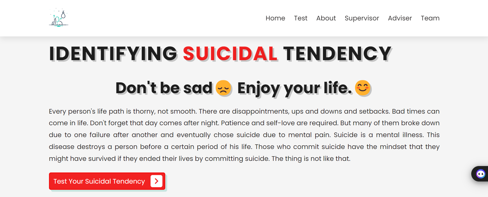
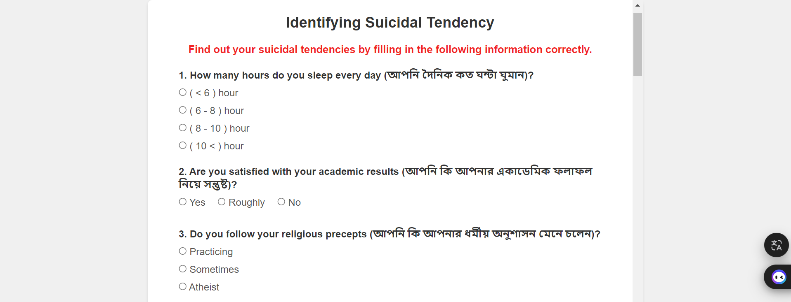
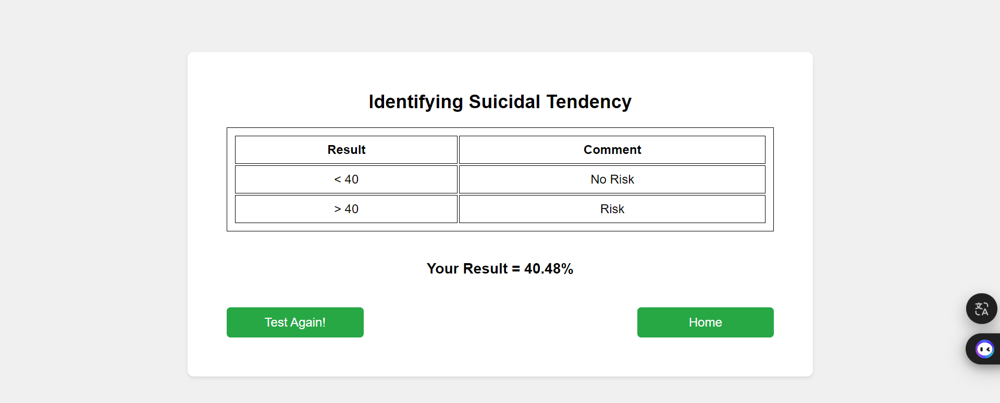
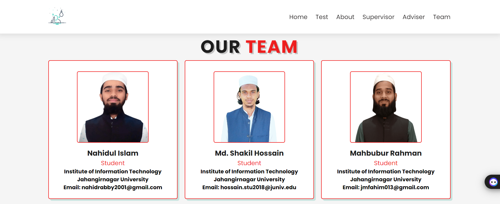

# Identifying Suicidal Tendency

A web-based mental health assessment tool designed to help identify suicidal tendencies through a comprehensive psychological questionnaire. This project was developed as an academic research initiative by final-year B.Sc. ICT students at Jahangirnagar University.

## 🎯 Project Overview

This application provides a user-friendly interface for conducting mental health screenings using a scientifically-informed questionnaire. The tool evaluates various psychological and social factors that may contribute to suicidal ideation and provides risk assessment results.

## ✨ Features

- **Comprehensive Assessment**: 21-question psychological evaluation covering multiple risk factors
- **Bilingual Support**: Questions available in both English and Bengali
- **Weighted Scoring System**: Different questions have varying impact weights (0.3 to 0.9)
- **Risk Classification**: Clear threshold-based categorization (≤40% = No Risk, >40% = Risk)
- **Responsive Design**: Optimized for both desktop and mobile devices
- **Professional Supervision**: Developed under academic and psychological expert guidance

## 🚀 Live Demo

[View Live Demo](https://shakiliitju.github.io/Identifying-Suicidal-Tendency/)

## 📸 Screenshots

### Home Page


### Assessment Questions


### Results Page


### Team Information


## 🛠️ Technologies Used

- **Frontend**: HTML5, CSS3, JavaScript (Vanilla)
- **Styling**: Custom CSS with Google Fonts (Poppins)
- **Icons**: Font Awesome 5.15.4
- **Design**: Responsive Grid Layout

## 📋 Assessment Categories

The questionnaire evaluates the following areas:

1. **Sleep Patterns** - Daily sleep duration
2. **Academic Performance** - Satisfaction with academic results
3. **Religious Practice** - Adherence to religious beliefs
4. **Personal Life** - Individual challenges and problems
5. **Social Life** - Social interaction and relationships
6. **Family Dynamics** - Family-related issues
7. **Suicide History** - Previous attempts or ideation
8. **Social Support** - Availability of trusted confidants
9. **Health Status** - Long-term illnesses
10. **Substance Use** - Addiction and substance abuse patterns
11. **Leisure Activities** - How free time is spent
12. **Social Media Usage** - Time spent on social platforms
13. **Abuse History** - Physical, mental, and sexual abuse
14. **Family History** - Suicide history in family
15. **Financial Status** - Money-related problems
16. **Emotional Expression** - Communication of feelings
17. **Anger Management** - Emotional regulation
18. **Self-Blame** - Guilt and self-perception
19. **Self-Harm** - History of self-inflicted injuries

## 🔧 Installation & Setup

1. **Clone the repository**
   ```bash
   git clone https://github.com/shakiliitju/Identifying-Suicidal-Tendency.git
   cd Identifying-Suicidal-Tendency
   ```

2. **Open the project**
   - No build process required
   - Simply open `index.html` in your web browser
   - Or use a local development server:
   ```bash
   # Using Python
   python -m http.server 8000
   
   # Using Node.js (http-server)
   npx http-server
   
   # Using Live Server (VS Code extension)
   Right-click on index.html → "Open with Live Server"
   ```

3. **Access the application**
   - Open your browser and navigate to `http://localhost:8000` (or the appropriate local server URL)

## 📁 Project Structure

```
Identifying-Suicidal-Tendency/
├── index.html              # Main landing page
├── test.html               # Assessment questionnaire
├── style.css               # Main stylesheet
├── test.css                # Test page specific styles
├── script.js               # Main page functionality
├── test.js                 # Assessment logic and scoring
├── LICENSE                 # MIT License
├── README.md               # Project documentation
├── image/                  # Images and assets
│   ├── logo.png           # Project logo
│   ├── team.jpg           # Team photo
│   ├── member1.png        # Team member photos
│   ├── member2.png
│   ├── member3.png
│   ├── Supervisor.jpg     # Supervisor photo
│   ├── adviser1.jpg       # Adviser photos
│   ├── adviser2.jpeg
│   ├── adviser3.jpg
│   └── Question-mark.jpg  # Question page graphic
└── Screenshot/            # Application screenshots
    ├── Home.png
    ├── Question_set.png
    ├── Result.png
    ├── team.png
    └── ...
```

## 👥 Team

### Students (Developers)
- **Md. Shakil Hossain** - hossain.stu2018@juniv.edu
- **Nahidul Islam** - nahidrabby2001@gmail.com
- **Mahbubur Rahman** - jmfahim013@gmail.com

### Academic Supervision
- **Dr. Fahima Tabassum** - Professor, Institute of Information Technology, Jahangirnagar University

### Expert Advisers
- **Ifrat Jahan** - Deputy Director (Psychology)
- **Subhashish Kumar Chatterjee** - Deputy Director (Psychology)
- **Md. Moyazzem Hossain** - Professor, Statistics and Data Science, Jahangirnagar University

## 🏛️ Institution

**Institute of Information Technology**  
Jahangirnagar University  
Savar, Dhaka-1342, Bangladesh

## ⚠️ Important Disclaimer

This tool is designed for educational and research purposes only. It is not a substitute for professional mental health diagnosis or treatment. If you or someone you know is experiencing suicidal thoughts, please seek immediate help from qualified mental health professionals or contact local emergency services.

### Crisis Resources
- **National Suicide Prevention Lifeline**: 988 (US)
- **Crisis Text Line**: Text HOME to 741741
- **International Association for Suicide Prevention**: https://www.iasp.info/resources/Crisis_Centres/

## 🔒 Privacy & Data

- No personal data is stored or transmitted
- All assessments are processed locally in the browser
- No external data collection or tracking

## 📄 License

This project is licensed under the MIT License - see the [LICENSE](LICENSE) file for details.

## 🤝 Contributing

While this is primarily an academic project, suggestions and feedback are welcome. Please feel free to:

1. Fork the repository
2. Create a feature branch (`git checkout -b feature/AmazingFeature`)
3. Commit your changes (`git commit -m 'Add some AmazingFeature'`)
4. Push to the branch (`git push origin feature/AmazingFeature`)
5. Open a Pull Request

## 📞 Contact

For academic inquiries or collaboration:

- **Project Lead**: Md. Shakil Hossain - hossain.stu2018@juniv.edu
- **Institution**: Institute of Information Technology, Jahangirnagar University
- **Project Website**: [Personal Portfolio](https://sites.google.com/view/shakiliitju/home)

## 📚 Research & Academic Use

This project is part of ongoing research in mental health assessment tools. If you use this work in academic research, please cite appropriately:

```
Hossain, M. S., Islam, N., & Rahman, M. (2025). 
Identifying Suicidal Tendency: A Web-Based Mental Health Assessment Tool. 
Institute of Information Technology, Jahangirnagar University.
```

## 🔄 Version History

- **v1.0.0** (2025) - Initial release with core assessment functionality
- Bilingual questionnaire implementation
- Responsive design and user interface
- Risk assessment and scoring system

---

**Note**: This project was developed as part of academic research at Jahangirnagar University under proper supervision and ethical guidelines for mental health research.
